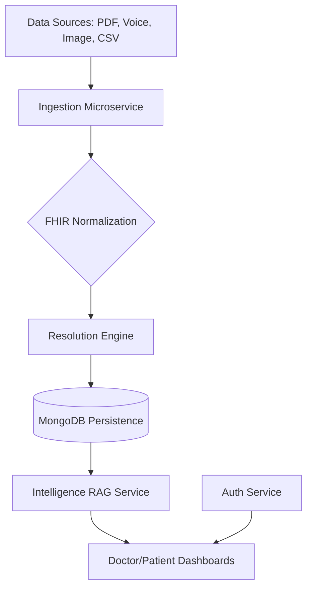

# 🏥 CareUnify Clinical Platform

[](https://opensource.org/licenses/MIT)
[](https://www.python.org/downloads/)
[](https://reactjs.org/)
[](https://fastapi.tiangolo.com/)

**CareUnify** is a production-grade, AI-driven Intelligent Clinical Data Integration Platform. It bridges the gap between fragmented patient records and actionable clinical intelligence by using state-of-the-art Entity Resolution and RAG (Retrieval-Augmented Generation).

---

## 🌟 Key Features

### 📥 Multi-Modal Ingestion Engine
Seamlessly ingest health data from various formats including:
- **Documents**: PDF, Word (Docx), CSV, Text.
- **Media**: Clinical Images (OCR) and Voice Memos (Transcription).
- **Standards**: Native FHIR R4 support for medical record normalization.

### 🧠 AI-Powered Intelligence
- **Entity Resolution**: Advanced hybrid matching to unify patient identity across disparate data sources.
- **RAG Engine**: Context-aware clinical chatbot that understands patient history and provides evidence-based summaries.
- **Role-Based UX**:
    - **Doctor Dashboard**: Population-level registry, risk heatmaps, and clinical alerts.
    - **Patient Health Dossier**: Individual diagnostic clusters and systemic risk factor visualizations.

### 🔒 Enterprise Grade Foundation
- **HIPAA-Ready Architecture**: Built with data segregation and clinical-grade security in mind.
- **Microservices Orchestration**: Scalable architecture with specialized services for Auth, Ingestion, Resolution, and Intelligence.

---

## 🏗️ Technical Architecture



### Tech Stack
- **Frontend**: React (Vite), JavaScript, Vanilla CSS.
- **Backend**: Python (FastAPI), Node.js (Auth Service).
- **Database**: MongoDB (Patient Registry & Clinical Store).
- **AI/ML**: LangChain, OpenAI/Gemini (RAG), Pandas (Entity Resolution).

---

## 🚀 Quick Start

### Prerequisites
- Python 3.10+
- Node.js 18+
- MongoDB (running locally or via Atlas)
- **Tesseract OCR**: Required for image-to-text processing.
- **FFmpeg**: Required for processing clinical voice memos.

### Installation

1. **Clone the repository**:
   ```bash
   git clone <repository-url>
   cd careunify-platform
   ```

2. **Setup Backend Environment**:
   ```bash
   python -m venv .venv
   source .venv/bin/activate  # On Windows: .venv\Scripts\activate
   pip install -r requirements.txt
   ```

3. **Configure Environment**:
   Create a `.env` file in the root directory with:
   ```env
   MONGODB_URI=your_mongodb_uri
   OPENAI_API_KEY=your_key
   AUTH_SECRET=your_jwt_secret
   ```

4. **Install Frontend Dependencies**:
   ```bash
   cd careunify_ui
   npm install
   cd ..
   ```

### 🛰️ Launching the Platform

Use the built-in orchestrator to launch all microservices and the UI concurrently:

```bash
python launch_platform.py
```

This will automatically open separate terminal windows for:
- 🛡️ **Auth Service** (Port 5000)
- 📥 **Ingestion Service** (Port 8000)
- 🧩 **Resolution Engine** (Port 8001)
- 🧠 **Intelligence Engine** (Port 8002)
- 💻 **UI Dashboard** (Port 5173)

---

## 📂 Project Structure

- `careunify/services/`: Core microservices (Auth, Ingestion, Resolution, Intelligence).
- `careunify/shared/`: Shared models and FHIR schemas.
- `careunify_ui/`: React frontend source code.
- `samples/`: Example clinical files for testing ingestion.
- `tests/`: End-to-end and unit testing suite.

---

## 🤝 Contributing

We welcome contributions! Please follow these steps:
1. Fork the Project.
2. Create your Feature Branch (`git checkout -b feature/AmazingFeature`).
3. Commit your Changes (`git commit -m 'Add some AmazingFeature'`).
4. Push to the Branch (`git push origin feature/AmazingFeature`).
5. Open a Pull Request.

---

## 📄 License

Distributed under the MIT License. See `LICENSE` for more information.

---

> [!NOTE]
> **Disclaimer**: This platform is a clinical decision support tool and should be used by licensed medical professionals. Always verify AI-generated insights against original clinical documentation.
